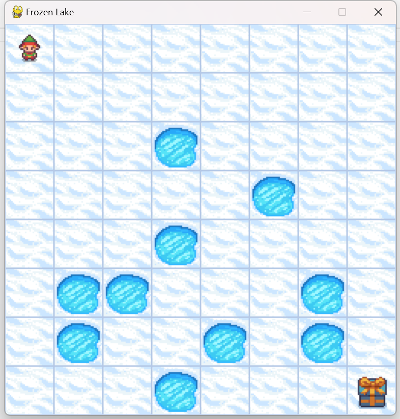

# FrozenLake Q-Learning Agent

## Project Overview

This project applies Q-learning, a reinforcement learning algorithm, to solve the classic "FrozenLake-v1" problem. The agent learns to navigate an 8x8 frozen lake environment, where it must find a safe path to the goal while avoiding holes and slippery surfaces.

The project uses the `gymnasium` library to simulate the environment, `matplotlib` for visualizing the learning progress, and `pickle` to save and load the trained Q-table. It supports both training and testing modes, allowing the user to train a new model or test an existing one.


## Dependencies

- Python 3.x
- gymnasium
- numpy
- matplotlib
- pickle

To install the required libraries, use the following command:

```bash
pip install gymnasium numpy matplotlib pickle
```

## How to Run

### Training Mode

To train a new agent, simply run the following command to start the Q-learning process. The agent will explore the environment and learn the best actions over time.

```bash
python frozen_lake_q.py
```

You can adjust the number of episodes (`episodes`) to control the length of the training process.

### Testing Mode

To test the agent using a pre-trained Q-table, modify the main function and set `is_training=False, render=True` in `run()`, run the following command:

```bash
python frozen_lake_q.py
```

This will load the saved Q-table and allow the agent to navigate the environment without updating the Q-values.

### Exiting Training

During training, you can use `Ctrl + C` at command line to interrupt and stop the training process.

### Visualization

Once training is complete, a plot showing the reward trend over episodes will be saved as `frozen_lake8x8.png`. The Q-Table will be saved as `frozen_lake8x8_q_table.png`.

## Training Parameters

- **Learning Rate (α)**: `0.9`
- **Discount Factor (γ)**: `0.9`
- **Initial Exploration Rate (ε)**: `1.0`, decays as training progresses
- **Exploration Rate Decay (ε_decay)**: `0.0001`
- **Number of Episodes**: Default is 15000 episodes

## File Explanation

- `frozen_lake_q.py`: The main script containing the training and testing logic
- `frozen_lake_q_table.pkl`: The saved Q-table after training, used for future testing
- `frozen_lake8x8.png`: A plot showing the reward trend during training
- `frozen_lake8x8_q_table.png`:A plot showing the heatmap of Q-Table

## Contributing

If you'd like to contribute to this project, feel free to open Issues or submit Pull Requests.


## License

This project is under the [MIT License](LICENSE).
